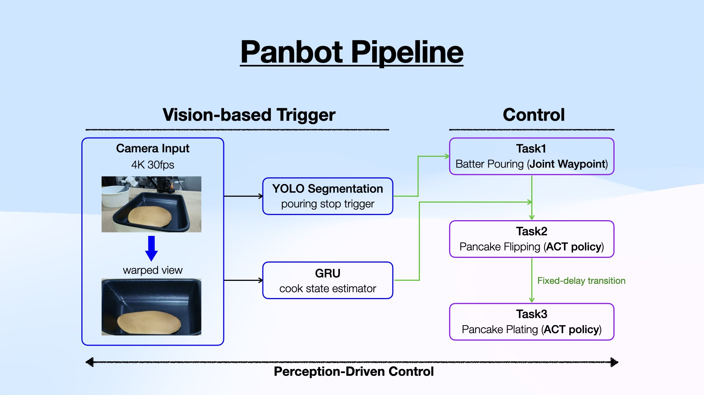

# Panbot

Vision-triggered pancake robot runtime for the **LeRobot SO-ARM101 / SO101 follower arm**.

Panbot combines a deterministic Task 1 motion sequence, a shared vision-trigger camera, YOLO segmentation, GRU cook-state estimation, and pretrained LeRobot ACT policies into one end-to-end robot control pipeline.

| Task 1: Batter Pouring | Task 2: Pancake Flipping | Task 3: Pancake Plating |
|---|---|---|
|  |  |  |
| Joint waypoint motion + YOLO stop trigger | ACT policy for flipping | ACT policy for plating |

| Task 2: Implicit Recovery | Task 3: Implicit Recovery |
|---|---|
|  |  |

Full runtime demo: [Panbot Demo - Vision-Triggered Runtime (YOLO + GRU + ACT)](https://youtu.be/SyGJ2h8aM98)

> [!IMPORTANT]
> **Core idea:** perception decides when the robot should move to the next stage.
> A single trigger camera watches the cooking state, while separate policy observation cameras feed the ACT policies during manipulation.

## Quick Start

### 1. Prepare the Environment

```bash
conda create -n panbot python=3.10 -y
conda activate panbot

pip install opencv-python torch torchvision
pip install lerobot
pip install ultralytics
```

> [!NOTE]
> Install the PyTorch build that matches your CUDA and driver setup. GPU inference is recommended for the vision modules and ACT policy rollout.

### 2. Check Runtime Configuration

Edit [`config/runtime.yaml`](config/runtime.yaml) before running:

```yaml
paths:
  corners: "Panbot/vision/calibration/corners.json"
  yolo_model: "Panbot/vision/models/runs/batter_seg_local_v1/weights/best.pt"
  gru_ckpt: "Panbot/vision/models/runs/resnet18_gru16_cls/best.pt"

vision:
  cam_index: 8      # shared YOLO/GRU trigger camera
  width: 3840
  height: 2160
  fps: 30

robot:
  port: "/dev/ttyACM0"
  cameras:          # policy observation cameras, separate from vision.cam_index
    right:  { type: "opencv", index_or_path: 2, width: 640, height: 480, fps: 30, fourcc: "MJPG" }
    left:   { type: "opencv", index_or_path: 6, width: 640, height: 480, fps: 30, fourcc: "MJPG" }
    global: { type: "opencv", index_or_path: 4, width: 640, height: 480, fps: 30, fourcc: "MJPG" }
    wrist:  { type: "opencv", index_or_path: 0, width: 640, height: 480, fps: 30, fourcc: "MJPG" }
```

### 3. Run the Runtime

```bash
cd ~/Panbot
chmod +x scripts/start_all.sh
./scripts/start_all.sh
```

Or run the module directly:

```bash
python -m Panbot.control.main_runtime --config Panbot/config/runtime.yaml
```

## Pipeline

<p align="center">
  
</p>

Panbot uses two camera paths:

| Camera path | Config key | Used by | Purpose |
|---|---|---|---|
| Trigger camera | `vision.cam_index` | YOLO + GRU | Decide when to switch stages |
| Policy cameras | `robot.cameras.*` | LeRobot ACT policies | Multi-view observations for action prediction |

> [!TIP]
> Keep this distinction clear when debugging. A trigger camera problem usually appears as a stage-transition failure; a policy camera problem usually appears as poor or missing ACT actions.

## Runtime Behavior

`Panbot/control/main_runtime.py` is the main orchestrator. It connects the robot, opens the shared trigger camera, initializes YOLO and GRU inference, runs Task 1, waits for readiness, then executes the pretrained policies for Task 2 and Task 3.

| Stage | Controller | Transition |
|---|---|---|
| 1. Batter pouring | `Task1MotionStepper` | YOLO segmentation detects enough batter coverage |
| 2. Return / hold | `Task1MotionStepper` + `BasePoseController` | Task 1 return sequence completes |
| 3. Cook readiness wait | `GRUInfer` | GRU trigger fires |
| 4. Pancake flipping | ACT policy 1 | Configured duration ends |
| 5. Pancake plating | ACT policy 2 | Configured duration ends |
| 6. Shutdown | Base pose + cleanup | Runtime exits cleanly |

### Stage Switching

```python
connect_robot()
trigger_cam = open_camera(vision.cam_index)

task1.start_initial()
while not yolo.step(trigger_cam.frame).triggered:
    task1.step()

task1.interrupt_to_return()
task1.run_return_sequence()

base_pose.hold()
while not gru.step(trigger_cam.frame).triggered:
    base_pose.tick()

run_policy(policy1, duration=task.task2_duration_s)  # Task 2: flipping
sleep(task.wait_task2_to_task3_s)
run_policy(policy2, duration=task.task3_duration_s)  # Task 3: plating

return_to_base_pose()
shutdown_cleanly()
```

## Implicit Recovery

Task 2 and Task 3 are not scripted waypoint motions. They are ACT policy rollouts trained from demonstrations, so recovery can emerge from the policy distribution when the scene drifts slightly from the nominal trajectory.

In practice, the policy can re-align after small perturbations such as imperfect pancake placement, minor contact mismatch, or a slightly shifted utensil interaction. The implicit recovery demos above show this behavior during flipping and plating.

> [!CAUTION]
> Implicit recovery is not a formal safety guarantee. It is useful for robustness, but the robot should still be tested in a constrained workspace with a reachable emergency stop.

## Configuration Guide

### Vision Trigger

```yaml
yolo_trigger:
  conf: 0.25
  imgsz: 640
  area_thr_ratio: 0.12
  hold_frames: 30
  use_warp: true

gru_trigger:
  image_size: 224
  seq_len: 16
  stride: 6
  ema: 0.7
  ready_hold: 3
  use_warp: true
```

| Key | Effect |
|---|---|
| `yolo_trigger.conf` | Segmentation confidence threshold |
| `yolo_trigger.area_thr_ratio` | Batter area ratio required for the Task 1 stop trigger |
| `yolo_trigger.hold_frames` | Number of stable frames before accepting the YOLO trigger |
| `gru_trigger.seq_len` | Temporal window length for cook-state inference |
| `gru_trigger.ema` | Confidence smoothing |
| `gru_trigger.ready_hold` | Stable ready frames required before triggering |

### Task Timing

```yaml
task:
  hz: 30
  policy_fps: 30
  task2_duration_s: 90.0
  task3_duration_s: 90.0
  wait_task2_to_task3_s: 30.0
```

Keep `task.hz`, `vision.fps`, and `policy_fps` aligned when possible. It makes trigger timing, policy rollout, and logs easier to reason about.

### Policy Checkpoints

```yaml
policies:
  policy1:
    repo_id: "ispaik06/act_panbot_task2_3"
  policy2:
    repo_id: "ispaik06/act_panbot_task3_3"
```

Public assets:

| Asset | Link |
|---|---|
| Task 2 dataset | https://huggingface.co/datasets/ispaik06/Panbot_task2_dataset_3 |
| Task 3 dataset | https://huggingface.co/datasets/ispaik06/Panbot_task3_dataset_3 |
| ACT Task 2 checkpoint | https://huggingface.co/ispaik06/act_panbot_task2_3 |
| ACT Task 3 checkpoint | https://huggingface.co/ispaik06/act_panbot_task3_3 |

## Repository Map

```text
Panbot/
├─ config/
│  └─ runtime.yaml                  # Runtime config
├─ control/
│  └─ main_runtime.py               # End-to-end orchestrator
├─ policies/
│  └─ common_policy_runner.py        # LeRobot pretrained policy runner
├─ tasks/
│  ├─ base_pose.py                   # Base pose holding / stabilization
│  └─ task1_motion.py                # Task 1 waypoint motion
├─ vision/
│  ├─ calibration/corners.json       # Optional perspective warp corners
│  ├─ models/runs/...                # YOLO and GRU checkpoints
│  └─ modules/
│     ├─ camera.py
│     ├─ gru_infer.py
│     └─ yoloseg_infer.py
├─ scripts/
│  └─ start_all.sh
├─ assets/
│  ├─ task1.gif
│  ├─ task2.gif
│  ├─ task3.gif
│  ├─ task2_implicit_recovery.gif
│  ├─ task3_implicit_recovery.gif
│  └─ panbot_pipeline.011.jpeg
└─ logs/
   └─ main_runtime_YYYYMMDD_HHMMSS.log
```

## Vision Modules

This repository focuses on runtime orchestration: robot control, trigger handling, stage transitions, and policy execution.

For vision training, dataset generation, preprocessing, model export, and lower-level inference details, see:

**Panbot_vision:** https://github.com/ispaik06/Panbot_vision

If you change warp geometry, preprocessing, label mapping, checkpoint format, or trigger thresholds in the vision repository, update [`config/runtime.yaml`](config/runtime.yaml) accordingly.

## Troubleshooting

| Symptom | Check |
|---|---|
| Trigger camera does not open | `vision.cam_index`, `vision.backend`, `vision.mjpg`, camera permissions |
| YOLO fires too early | Increase `area_thr_ratio` or `hold_frames`; raise `conf` |
| YOLO never fires | Lower `area_thr_ratio`; verify warp corners and model path |
| GRU trigger is late | Tune `ema`, `ready_hold`, `seq_len`, and `stride` |
| ACT policy does not move | Check policy `repo_id`, robot connection, and whether `robot.send_action(...)` is reached |
| Policy behavior is poor | Verify `robot.cameras.*` indices, camera resolution, observation names, and lighting |

Logs are written to `log.dir`, typically:

```text
Panbot/logs/main_runtime_YYYYMMDD_HHMMSS.log
```

## Collaborators

- [ispaik06](https://ispaik06.github.io)
- [NmDongQ](https://github.com/NmDongQ)
